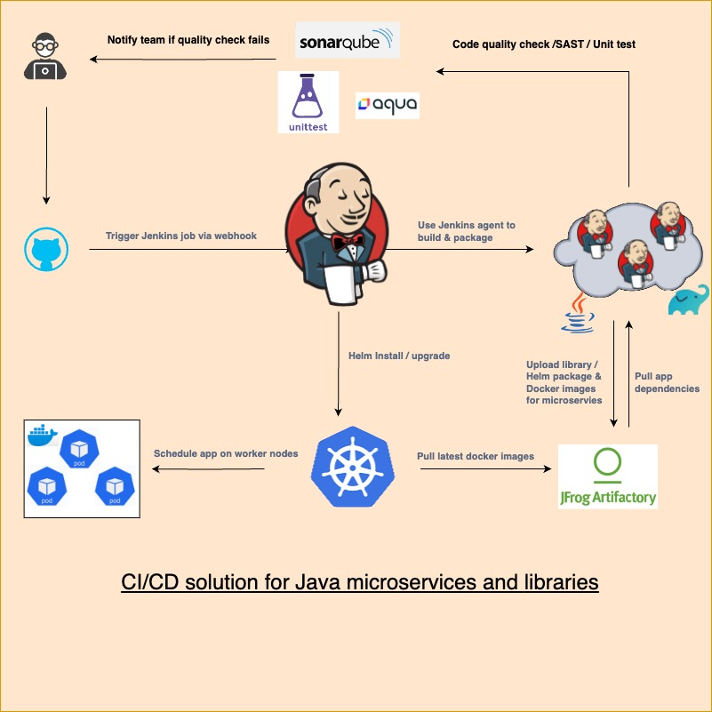

# Solving-CI-CD

## CI/CD process for java based microservice

## CI/CD process for java based microservice
Below are some more details able different phases in CI / CD.

### Build Phase
* Developer will pushes to github.
* Github will notifiy Jenkins via webhook call. (Jenkins webhook endpoint should be accessible from github)
* Jenkins will trigger the a multibranch pipeline on one of the available agents to avoid overwhelming main server.
* Gradle can be used to build the code. 
* Build container & helm chart. 

### Testing Phase
* Run Unit test using junit.
* Run AquaSec/prisma scan on recently build container.
* Fail build if any critical vulnerabilities 
* Run SonarScan for code quality/code coverage.
* Run sonarqube to SAST Scan
* Add Quality gates so build will fail if quality is not met.

### Publish Phase
* Publish Docker image to artifactory docker repo.
* Publish library to artifactory gradle repo.
* Publish helm chart in helm repo.

### Deploy Phase (nonprod)
* To verify whats getting deployed `helm diff` can be used. 
* To deploy the code we can perform `helm upgrade/install` in branch named namespace.
* have a cleanup job in jenkins to cleanup branch namespace after sometime.

### Deploy Phase (prod)
* To verify whats getting deployed `helm diff` can be used. 
* To deploy the code we can perform `helm upgrade/install` in main namespace.

